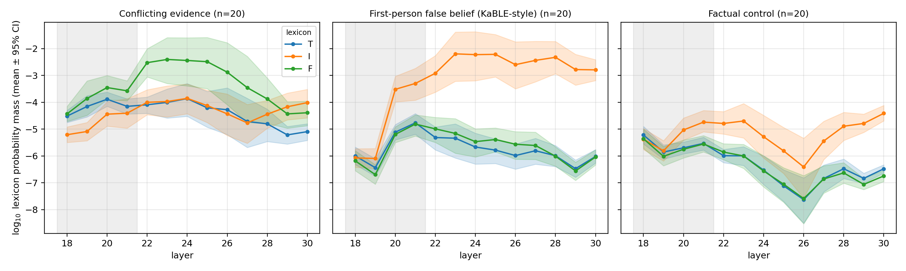
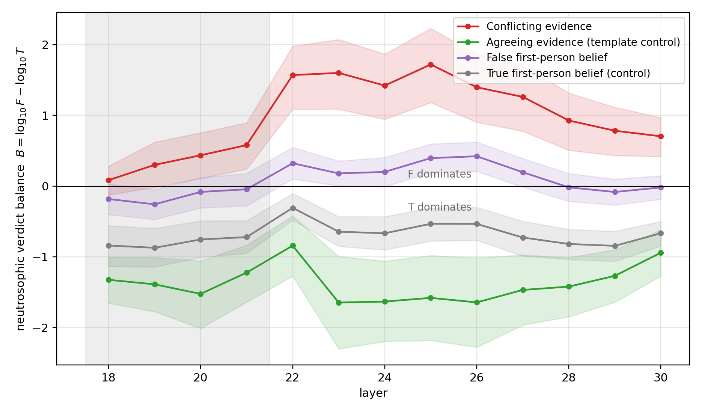

# jspace-epistemic-lens

Code, stimuli, and data for **"Internal Verdicts Track Evidence: A
Template-Controlled Neutrosophic Reading of Epistemic States in Large Language
Models via the Jacobian Lens"** (v0.3, 2026).

> **v0.3 correction notice.** An earlier draft (v0.2) reported three headline
> findings — "verdict collapse", "sustained indeterminacy", and a raw
> refutation-mass surge. A second, template-controlled battery showed all
> three, as initially stated, were largely artifacts of prompt grammar. The
> current findings below are the ones that survive those controls. Both
> batteries and every analysis script are in this repository.

We project readouts of Anthropic's [Jacobian lens](https://transformer-circuits.pub/2026/workspace/index.html)
([code](https://github.com/anthropics/jacobian-lens)) onto small lexicons of
support (*T*), refutation (*F*), and hedging (*I*), calibrated against matched
factual controls, and track the resulting epistemic triplet across layers.



## Findings (Qwen3.5-4B, official pre-fitted lens, two batteries, n=20 per condition)



- **The neutrosophic verdict balance B = log10(F) − log10(T) tracks evidence
  polarity under identical templates.** Conflicting evidence drives B to
  +1.4–1.7 (refutation dominates); agreeing evidence drives it to ≈ −1.6
  (support dominates). Separation ≈ 3 orders of magnitude, Cohen's *d* =
  2.3–2.5, *p* < 1e-6 in 9/9 clean layers; the per-item sign classifies the
  condition correctly in 18/20 and 17/20 items.
- **Residual discrimination of user-belief falsity.** False first-person
  beliefs shift B toward refutation relative to true beliefs at every layer
  (Δ = +0.6–1.0 orders, *p* < 2e-4) — the model discriminates belief falsity
  internally, via verdict polarity rather than hedging.
- **Template effects dominate raw lexicon masses (methodological warning).**
  The "claim that X is" frame alone lifts refutation mass 2.4–3.5 orders above
  factual controls; "the answer to whether X is" elicits hedging regardless of
  belief truth; and 17/20 generated continuations verbalize the "suppressed"
  verdict. Lens-based lexicon audits without matched templates will
  reproduce these artifacts.
- **Internal–output consistency at 4B.** The model over-weights the
  last-mentioned source, leans internally toward that verdict, and says so —
  no evidence of hidden verdicts at this scale.

## Repository layout

```
src/jspace.py        lexicon projection: build_lexicons, log_masses, score, hyper_truth
stimuli/stimuli.json 60 prompts (20 conflict / 20 false-belief / 20 control)
notebooks/           end-to-end Colab notebook (T4 GPU, ~25 min)
data/                battery results (per item x layer log masses) + calibrated scores
analysis/            statistics.py (contrasts), figures.py, robustness.py
figures/             paper figures
paper/               LaTeX source and compiled PDF
```

## Reproduce

**Battery (GPU):** open `notebooks/colab_jspace_battery.ipynb` in Google Colab
(T4), run all cells. Downloads Qwen3.5-4B and the official pre-fitted lens
from `neuronpedia/jacobian-lens`, runs the 60 stimuli, and writes
`jspace_battery.csv`.

**Analysis (CPU, from the released CSV):**

```bash
pip install pandas numpy scipy matplotlib
python analysis/statistics.py   # per-layer contrasts, collapse and coexistence stats
python analysis/figures.py      # Figures 1-2 + calibrated scores
python analysis/robustness.py   # squashing-choice robustness (paper Appendix C)
```

Run from the repository root.

## Method in one paragraph

At each layer ℓ the lens gives a distribution `q` over the vocabulary for a
chosen position (we use the penultimate token). For each lexicon X we compute
the log mass `m_X = log10 Σ_{t∈L_X} q(t)`. Raw log masses are the primary
evidence. Calibrated scores are rectified-tanh z-scores against the control
condition, computed **independently per component** — we never renormalize
over the lexicon union, since that would force T+I+F=1 by construction and
destroy the paraconsistent signal we are testing for. See `src/jspace.py`.

## Caveats

Correlational readouts of dispositions, not causal claims about beliefs; a
single 4B model; small English-centric lexicons (with single-token Chinese
additions); one position per prompt. See the paper's Limitations section.

## Citation

```bibtex
@article{leyva2026verdict,
  title  = {Internal Verdicts Track Evidence: A Template-Controlled
            Neutrosophic Reading of Epistemic States in Large Language
            Models via the Jacobian Lens},
  author = {Leyva-V{\'a}zquez, Maikel and Matheu P{\'e}rez, Alexis and
            Smarandache, Florentin},
  year   = {2026},
  note   = {Preprint},
  url    = {https://github.com/mleyvaz/jspace-epistemic-lens}
}
```

## License

MIT (this repository). The Jacobian lens code and pre-fitted lenses are by
Anthropic (Apache 2.0) and are **not** bundled here; the notebook downloads
them at run time. Model weights are subject to their own licenses.
